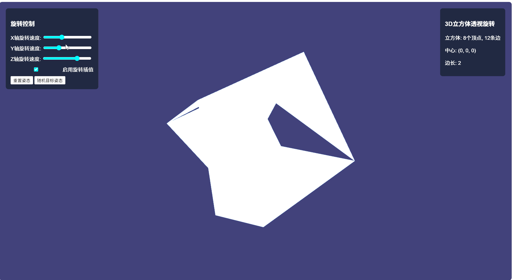

学号：202411081017
姓名：吴鑫
专业：计算机科学与技术（公费师范）

# 3D立方体透视旋转

基于 WebGL 实现的 3D 立方体透视旋转演示项目。


## 功能特性

- **三轴旋转控制**: 支持 X、Y、Z 三个轴的旋转速度独立调节
- **旋转插值**: 可启用/禁用平滑旋转插值效果
- **姿态控制**: 提供重置姿态和随机目标姿态功能
- **实时渲染**: 使用 WebGL 实现 60fps 流畅渲染

## 技术栈

- **前端**: HTML5 + CSS3 + JavaScript (ES6+)
- **3D渲染**: WebGL 1.0
- **矩阵运算**: 手写 mat4 矩阵库（透视投影、平移、旋转）
- **零依赖**: 无需任何第三方库

## 运行方式

直接在浏览器中打开 `index.html` 文件即可运行：

```bash
# 方式1: 使用默认浏览器打开
start index.html

# 方式2: 使用本地服务器（推荐）
python -m http.server 8000
# 然后访问 http://localhost:8000
```

## 项目结构

```
├── index.html    # 主页面，包含UI控制和Canvas
├── main.js       # WebGL渲染逻辑和mat4矩阵库
```

## 项目说明

- 立方体包含 8 个顶点、12 条边
- 立方体中心位于坐标原点 (0, 0, 0)
- 立方体边长为 2（从 -1 到 1）
- 采用透视投影，视角 45°，近平面 0.1，远平面 100.0