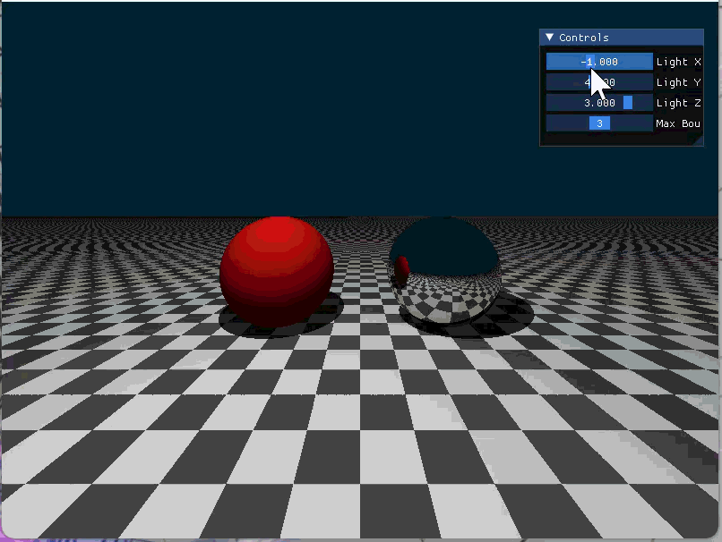

# 光线追踪演示 (Ray Tracing Demo)

使用 Taichi 实现的简单光线追踪渲染器。

## 功能特性

- ✅ **三维场景搭建**
  - 无限大平面（棋盘格纹理）
  - 红色漫反射球体
  - 银色镜面球体
- ✅ **材质系统**
  - 漫反射材质
  - 镜面反射材质
- ✅ **光照系统**
  - Phong 光照模型
  - 硬阴影
- ✅ **交互式控制**
  - 光源位置可调（X、Y、Z轴）
  - 最大弹射次数可调

## 环境要求

- Python 3.9 - 3.13
- Taichi 1.x

## 安装依赖

```bash
pip install taichi
```

## 运行方法

```bash
python ray_tracing.py
```

## 效果展示



## 项目结构

```
work5/
├── ray_tracing.py    # 光线追踪主程序
├── README.md         # 项目说明文档
└── 效果展示.gif      # 效果演示
```
